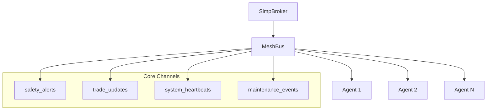

# SIMP Agent Mesh Bus

## Overview

The SIMP Agent Mesh Bus is a store-and-forward messaging system for agent-to-agent communication within the SIMP ecosystem. It provides structured, channel-based messaging with support for offline agents, priority levels, and message expiration.

## Architecture



## Key Components

### 1. MeshPacket
The fundamental message unit with:
- **Versioning**: Protocol version tracking
- **Message Types**: Event, Command, Reply, Heartbeat, System
- **UUIDs**: Message and correlation IDs
- **TTL**: Hops and seconds-based expiration
- **Priority**: Low, Normal, High
- **Routing History**: Track message path through system

### 2. MeshBus
In-memory store-and-forward router:
- Thread-safe agent queues
- Channel subscriptions with wildcards
- Store-and-forward for offline agents
- TTL-based expiration
- Structured logging to `data/mesh_events.jsonl`

### 3. MeshClient
Agent API for broker communication:
- HTTP client for broker endpoints
- Methods for send, poll, subscribe, unsubscribe
- Convenience methods for common patterns

## Core Channels

### safety_alerts
**Purpose**: Critical safety and security notifications
- **Producers**: BRP, ProjectX, Watchtower, QuantumArb
- **Consumers**: ProjectX (primary), Dashboard, Watchtower
- **Auto-subscription**: All agents automatically subscribed

### trade_updates
**Purpose**: Real-time trading activity
- **Producers**: QuantumArb, Execution Engine, Risk Monitor
- **Consumers**: Risk Monitor, Dashboard, P&L Ledger

### system_heartbeats
**Purpose**: Agent health status
- **Producers**: All registered agents
- **Consumers**: ProjectX, Dashboard, Orchestration Manager

### maintenance_events
**Purpose**: System maintenance recommendations
- **Producers**: ProjectX, Ops Scripts, Security Audit
- **Consumers**: All agents, Dashboard, ProjectX

## Message Flow Examples

### 1. Safety Alert Flow
```
BRP detects high risk → safety_alerts channel → ProjectX analyzes → maintenance_events channel → Dashboard displays → Watchtower reacts
```

### 2. Trade Update Flow
```
QuantumArb detects opportunity → trade_updates channel → Risk Monitor checks limits → Execution Engine executes → P&L Ledger records
```

### 3. Health Monitoring Flow
```
Agent sends heartbeat → system_heartbeats channel → ProjectX monitors → Dashboard displays status → Orchestration routes tasks
```

## Code Examples

### Basic Usage
```python
from simp.mesh.client import MeshClient

# Create client
client = MeshClient(agent_id="my_agent", broker_url="http://localhost:5555")

# Subscribe to channels
client.subscribe("safety_alerts")
client.subscribe("trade_updates")

# Send message to agent
client.send_to_agent(
    recipient_id="quantumarb",
    payload={"signal": "buy", "confidence": 0.85},
    msg_type="event"
)

# Send message to channel
client.send_to_channel(
    channel="safety_alerts",
    payload={"alert_type": "risk_limit", "severity": "WARNING"},
    msg_type="event"
)

# Poll for messages
messages = client.poll(max_messages=10)
for packet in messages:
    print(f"Received: {packet.payload}")
```

### ProjectX Integration
```python
from projectx_mesh_integration import get_mesh_monitor

# Get mesh monitor
monitor = get_mesh_monitor()

# Start monitoring
monitor.start()

# Send maintenance event
from projectx_mesh_integration import MaintenanceEvent

event = MaintenanceEvent(
    kind="pause_suggested",
    severity="WARNING",
    details={
        "agent": "quantumarb",
        "reason": "High risk detected",
        "suggested_action": "pause_trading"
    }
)
monitor.send_maintenance_event(event)
```

## File Locations

### Core Implementation
- `simp/mesh/packet.py` - MeshPacket class and message types
- `simp/mesh/bus.py` - MeshBus store-and-forward router
- `simp/mesh/client.py` - MeshClient HTTP API
- `simp/mesh/__init__.py` - Module exports

### Broker Integration
- `simp/server/broker.py` - MeshBus instantiation in SimpBroker
- `simp/server/http_server.py` - Mesh HTTP endpoints (`/mesh/*`)

### ProjectX Integration
- `ProjectX/projectx_mesh_integration.py` - ProjectX mesh monitor
- `ProjectX/projectx_guard_server.py` - Mesh monitor startup

### Documentation
- `docs/MESH_BUS_CHANNELS.md` - Core channels specification
- `docs/OBSIDIAN_MESH_BUS.md` - This overview document

## Testing

### Unit Tests
- `tests/test_mesh_packet.py` - Packet creation and validation
- `tests/test_mesh_bus.py` - Bus functionality and thread safety
- `tests/test_mesh_client.py` - Client API and HTTP integration
- `tests/test_mesh_relay.py` - End-to-end message flow

### Integration Tests
- `tests/mesh_smoke_test.py` - Basic smoke test
- `examples/mesh_bus_demo.py` - Demonstration script

### Running Tests
```bash
# Run all mesh tests
python3.10 -m pytest tests/test_mesh_*.py -v

# Run specific test
python3.10 -m pytest tests/test_mesh_bus.py::TestMeshBus::test_send_receive -v
```

## Configuration

### Broker Configuration
The MeshBus is automatically instantiated in the SimpBroker:
```python
# In simp/server/broker.py
from simp.mesh import get_mesh_bus

class SimpBroker:
    def __init__(self):
        # MeshBus for agent-to-agent messaging
        self.mesh_bus = get_mesh_bus()
```

### Agent Auto-registration
Agents are automatically registered with MeshBus when they register with the broker:
```python
# Auto-subscribe to safety_alerts for all agents
self.mesh_bus.register_agent(agent_id)
self.mesh_bus.subscribe(agent_id, "safety_alerts")
```

## Monitoring and Logging

### Mesh Events Log
All mesh activity is logged to `data/mesh_events.jsonl`:
```json
{
  "timestamp": "2024-04-14T12:00:00Z",
  "event_type": "MESSAGE_SENT",
  "agent_id": "quantumarb",
  "channel": "trade_updates",
  "message_id": "uuid",
  "priority": "normal"
}
```

### Statistics Endpoint
Get mesh statistics via HTTP:
```bash
curl http://localhost:5555/mesh/stats
```

## Best Practices

### 1. Use Structured Payloads
Always use the JSON formats specified in `MESH_BUS_CHANNELS.md`

### 2. Set Appropriate Priority
- **HIGH**: Safety alerts, critical errors
- **NORMAL**: Trading updates, maintenance events
- **LOW**: Heartbeats, status updates

### 3. Include Trace IDs
For correlating events across systems:
```python
payload = {
    "alert_type": "risk_limit",
    "trace_id": "llm_trace_123"
}
```

### 4. Handle Message Expiration
Set appropriate TTL based on message importance:
- Safety alerts: 300 seconds
- Trade updates: 60 seconds
- Heartbeats: 30 seconds

## Integration Patterns

### 1. ProjectX as Mesh Interpreter
ProjectX serves as primary consumer and decision maker:
- Analyzes safety alerts for patterns
- Emits maintenance recommendations
- Monitors agent health
- Correlates events using trace IDs

### 2. Dashboard as Mesh Visualizer
Dashboard displays real-time mesh activity:
- Shows active channels and message rates
- Displays safety alerts prominently
- Visualizes agent health status

### 3. Agent Lightning for Trace Correlation
Agent Lightning uses mesh events for:
- Correlating LLM traces with mesh events
- Understanding system context
- Providing explanations for actions

## Next Steps

### Short-term (Phase 1)
1. **ProjectX Integration Complete** - Listening to safety_alerts, emitting maintenance_events
2. **Dashboard Integration** - Display mesh activity in real-time
3. **QuantumArb Integration** - Send trade updates via mesh

### Medium-term (Phase 2)
1. **Disk Persistence** - Store offline queues to disk
2. **ProjectX Pattern Detection** - Analyze mesh logs for patterns
3. **Encryption Layer** - Secure sensitive message content

### Long-term (Phase 3)
1. **Distributed Mesh** - Multiple broker instances
2. **Channel Management UI** - Operator interface
3. **Advanced Analytics** - Predictive issue detection

## Troubleshooting

### Common Issues

1. **Agent not registered with MeshBus**
   - Ensure agent is registered with broker first
   - Check broker logs for registration errors

2. **Messages not delivered**
   - Check agent is online (heartbeats)
   - Verify channel subscription
   - Check message TTL hasn't expired

3. **HTTP 404 on mesh endpoints**
   - Ensure broker has mesh integration
   - Check broker is running latest code
   - Verify endpoint URLs are correct

### Debugging Commands
```bash
# Check mesh stats
curl http://localhost:5555/mesh/stats

# Check mesh events
curl http://localhost:5555/mesh/events

# Check agent mesh status
curl http://localhost:5555/mesh/agent/quantumarb/status
```

## References

- [SIMP Protocol Documentation](docs/)
- [Mesh Bus Channels Specification](docs/MESH_BUS_CHANNELS.md)
- [ProjectX Integration](ProjectX/projectx_mesh_integration.py)
- [Test Suite](tests/test_mesh_*.py)

---

*Last updated: 2024-04-14 | SIMP Protocol v0.3.0 | Mesh Bus v0.1.0*